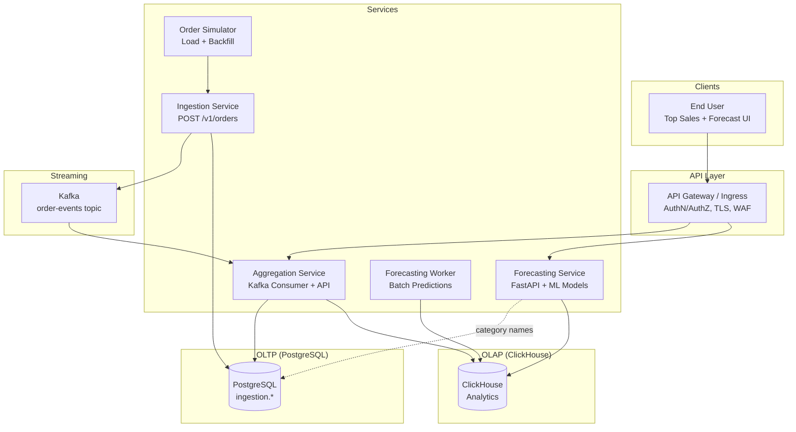
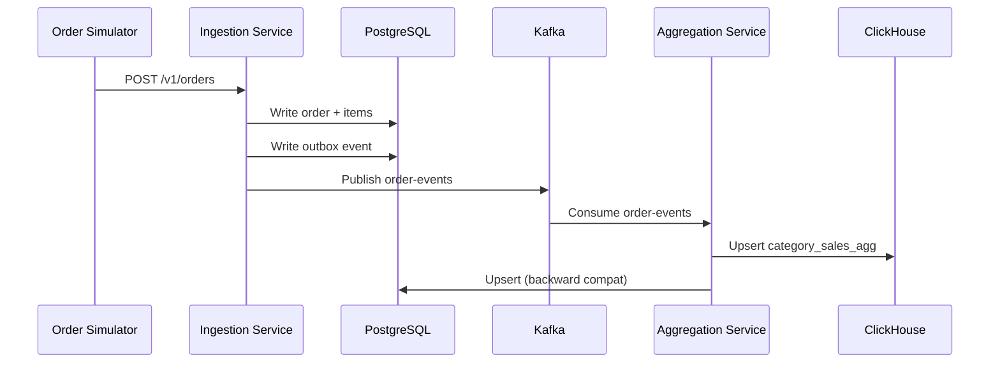

## Requirements & Assumptions

## Problem scope (functional)

- Ingest commerce orders for a merchant and persist them via an Orders API.

- Compute and serve "top sales by category" for selectable timeframes (week, month, year) through a user-friendly UI.
    
- Forecast next-period "top sales by category" and allow users to view results via UI/API endpoints (including model selection/compare).
    
## Non-functional requirements

- High availability: the read path (top categories + forecasts) should remain available under partial failures, with graceful degradation when compute pipelines lag.
    
- Accuracy & consistency: aggregates must converge without double-counting; forecasts must be reproducible for a given model/version and input series.
    
- Scalability: support many merchants and increasing order volume with horizontal scaling and partitioning.
    
- Observability: health checks, lag metrics, and failure alerting for ingestion->Kafka->aggregation and forecast generation.
    

## Assumptions

- Merchant catalog (merchants/categories/products) exists and is considered "platform-owned"; this design only consumes those concepts.
    
- Ranking definition: "top sales" means sorting categories by total sales amount for the merchant in a selected timeframe window.
    
- Time semantics: production supports calendar-aligned week/month/year with a configurable merchant timezone + "week starts on X" policy (default can be UTC/Monday).
    
- Consistency model: eventual consistency is acceptable between order creation and aggregate/forecast availability, but the system must converge.

- Flat categories: categories are non-hierarchical (no parent-child relationships). If hierarchical categories are needed in production (e.g., "Smartphones → Phones → Electronics"), add `parent_category_id` with recursive queries for roll-up reporting.

- Single currency per merchant: each merchant operates in a single base currency (e.g., USD, EUR, INR). Currency is stored on the merchant, and **snapshotted on the order** to guarantee historical integrity. No currency conversion is implemented. Production multi-currency support would require exchange rate tables and normalization at ingestion or aggregation time.
    

## Architecture

## Components (implemented)

- **Order Simulator**: generates/backfills orders and POSTs to ingestion-service; waits on ingestion health endpoint before sending traffic.
    
- **Ingestion Service**: exposes `POST /v1/orders` and persists orders + outbox rows in PostgreSQL.
    
- **Outbox Relay (in ingestion service)**: scheduled publisher reads `ingestion.order_events` and publishes to Kafka topic `order-events`.
    
- **Aggregation Service**: consumes `order-events`, dedupes using `forecasting.processed_events` (Postgres for exactly-once), and upserts bucketed totals into **ClickHouse** `category_sales_agg` (Single Source of Truth for Analytics).
  
- **Forecasting Service (FastAPI)**: serves UI + endpoints like `/forecast/top-categories`. Reads from **ClickHouse** for analytics and joins with Postgres for category names.
    
- **Forecasting Worker**: periodic scheduler to precompute forecasts for merchants and store them in **ClickHouse** `category_sales_forecast`.
    
- Compose wiring shows ingestion (8081), aggregation (8082), forecasting (8090), plus Kafka/Postgres/Consul.
    

## Architecture Overview



---

## Data Flow

### Order Ingestion → Aggregation



### Forecast Generation

| Flow | Source | Destination |
|------|--------|-------------|
| **Real-time writes** | `OrderEventsConsumer` → `bulkUpsert()` | ClickHouse |
| **Real-time reads** | `ForecastingService._fetch_series()` | ClickHouse |
| **ML training data** | `fetch_category_time_series()` | ClickHouse |
| **Forecast storage** | `save_forecast_results()` | ClickHouse |
| **Category names** | `_get_category_names_from_postgres()` | PostgreSQL |

> [!IMPORTANT]
> The `ingestion.categories` table stays in PostgreSQL. ClickHouse only holds pre-aggregated analytics data. Category name lookups still query PostgreSQL.

---

## How Real-Time vs ML Models Work with ClickHouse

### Real-Time Analytics (Top Categories API)

```
User Request → Aggregation Service → ClickHouse (category_sales_agg)
                                           ↓
                           JOIN with PostgreSQL (category names)
                                           ↓
                                     Response
```

- **Query performance**: ClickHouse is 10-100x faster for aggregations
- **Data freshness**: Near real-time (ReplacingMergeTree merges in background)
- **JOINs**: Category names fetched separately from PostgreSQL to avoid cross-DB joins

### ML Model Training & Inference

```
Worker (every 60s) → ClickHouse (fetch time series)
                           ↓
              Run models (rolling, WMA, SES, ARIMA, SNAIVE)
                           ↓
              ClickHouse (store forecasts in category_sales_forecast)
```

- **Training data**: Fetched from ClickHouse's `category_sales_agg`
- **Model output**: Stored in ClickHouse's `category_sales_forecast`
- **Performance**: ClickHouse excels at reading large time-series for training

### API Flow (Forecast Request)

```
Forecast API → ForecastingService._fetch_series() → ClickHouse
                           ↓
                    Run model inference
                           ↓
                    Return predictions
```

---
## Production-grade components (not implemented, recommended)

- **Identity/tenancy**: JWT/OAuth, merchant scoping, RBAC, audit logs.
    
- **Schema management**: schema registry for events (Avro/Protobuf/JSON Schema) + compatibility enforcement.
    
- **DLQ + retry topics**: poison-message handling for `order-events`, with dead-letter routing and replay tooling.
    
- **Centralized observability**: metrics (consumer lag, job duration), tracing, structured logs, alerting.
    
- **Caching layer**: Redis for hot "top categories" and forecast results.
    
- **Job orchestration**: replace in-process scheduler with a distributed scheduler (K8s CronJob/Airflow/Temporal) supporting retries, sharding, and leader election.
    
- **HA data stores**: Postgres replication/failover, read replicas for query-heavy endpoints.

- **TSID/Snowflake IDs**: Replace DB-generated `orderId` with globally unique, time-sorted IDs when scaling to multiple ingestion instances.
    
- **Flink/Spark streaming**: Replace batch aggregation with real-time stream processing for lower latency.
    

## Interfaces (API + events)

## Ingestion service API

- **POST** `/v1/orders` -> creates an order (201 response).
    
    - Used by order-simulator to drive load/backfill.
    - Uses `externalOrderId` for API-level idempotency (client-provided UUID prevents duplicates on retries).

## Aggregation service API (actuals)

- **GET** `/api/top-categories` with `merchantId`, `bucketType`, `bucketStart`, `limit` returns top categories by aggregated sales amount.

## Forecasting service API (predictions)
> **Note**: Currency is implied by the `merchant_id`. Since each merchant uses one currency, the forecast values (e.g., 5000) are in that merchant's base currency. Explicit currency in response is deferred until multi-currency support is needed.

### Endpoints

| Endpoint | Purpose | Speed | Data Source |
|----------|---------|-------|-------------|
| `/forecast/top-categories` | Real-time forecast generation | Slower | Live computation |
| `/forecast/compare-models` | Pre-computed forecast lookup | Fast | Database (worker output) |
| `/evaluate-models` | Model accuracy evaluation | Slowest | Live walk-forward validation |

#### GET `/forecast/top-categories`
**Purpose**: Generate forecasts on-the-fly for the top N categories.

| Parameter | Type | Description |
|-----------|------|-------------|
| `merchant_id` | int | Merchant identifier (required) |
| `bucket_type` | string | `DAY`, `WEEK`, or `MONTH` |
| `model` | string | `rolling`, `wma`, `ses`, `snaive`, `arima` (default: `rolling`) |
| `lookback` | int | Window size for rolling models (1-12) |
| `limit` | int | Max categories to return (1-20) |

#### GET `/forecast/compare-models`
**Purpose**: Fetch the latest pre-computed forecasts from the worker.

| Parameter | Type | Description |
|-----------|------|-------------|
| `merchant_id` | int | Merchant identifier (required) |
| `limit` | int | Max categories to return (1-20) |

**Use case**: Dashboard display, quick lookups. Data is refreshed by `forecasting-worker` every 60 seconds.

#### GET `/evaluate-models`
**Purpose**: Run walk-forward validation to compare model accuracy.

| Parameter | Type | Description |
|-----------|------|-------------|
| `merchant_id` | int | Merchant identifier (required) |
| `bucket_type` | string | `DAY`, `WEEK`, or `MONTH` |
| `test_points` | int | Number of points for holdout testing |

**Use case**: Model selection, accuracy analysis. Returns MAE/RMSE metrics per model.

### Health Endpoints
- **GET** `/health` - Service liveness check
- **GET** `/health/postgres` - Database connectivity check

## Event contract (internal)

- Kafka topic: `order-events` produced by ingestion outbox relay and consumed by aggregation service.
    
- Simplified payload (uses `orderId` for downstream idempotency):
```json
{
  "orderId": 12345,
  "merchantId": 1,
  "orderDate": "2024-01-15T10:30:00Z",
  "items": [
    {"categoryId": 2, "quantity": 3, "lineAmount": 59.97}
  ]
}
```
    
- Production recommendation: versioned schema + TSID/Snowflake for globally unique IDs when scaling.
    
## Data model (DB schemas with PK/FK)

## Schema separation

- **PostgreSQL** (`ingestion.*`): OLTP entities and the outbox table for transactional workloads.
    
- **ClickHouse** (analytics): Time-series aggregates and forecast results, optimized for analytical queries.
  - Uses ReplacingMergeTree engine for upsert semantics
  - Partitioned by month for efficient time-range queries
  - Category names are fetched from PostgreSQL at query time

## ingestion schema - PostgreSQL (PK/FK)

- `ingestion.merchants` ... (Unchanged)
        
- `ingestion.categories` ... (Unchanged)
        
- `ingestion.products` ... (Unchanged)
        
- `ingestion.orders` ... (Unchanged)
        
- `ingestion.order_items` ... (Unchanged)
        
- `ingestion.order_events` (outbox) ... (Unchanged)
        

## Analytics Tables - ClickHouse

- `category_sales_agg`
    - **Engine**: ReplacingMergeTree(updated_at)
    - **ORDER BY**: `(merchant_id, category_id, bucket_type, bucket_start)`
    - Stores aggregated sales by DAY, WEEK, MONTH buckets.
        
- `processed_events`
    - **Engine**: ReplacingMergeTree(processed_at)
    - **ORDER BY**: `order_id`
    - Uses `orderId` from ingestion for tracking processed orders.
        
- `category_sales_forecast`
    - **Engine**: MergeTree()
    - **ORDER BY**: `(merchant_id, category_id, model_name, generated_at)`
    - Stores precomputed forecasts with model results as JSON.


## "Year" timeframe modeling (required by scope)
... (Unchanged)

## Operations (dataflow, failures, HA/scale knobs, tradeoffs)

## End-to-end dataflow

- **Orders**: simulator posts to ingestion `/v1/orders`, ingestion writes OLTP rows + outbox row.
    
- **Events**: outbox publisher periodically reads unprocessed events and publishes to Kafka `order-events`.
    
- **Aggregates**: aggregation service consumes `order-events`, dedupes via Postgres `forecasting.processed_events`, and upserts bucketed totals into **ClickHouse** `category_sales_agg`.
    
- **Forecasts**: forecasting worker periodically fetches series from ClickHouse and writes results to **ClickHouse** `category_sales_forecast`.
    

## Idempotency model

1. **API layer** (`externalOrderId`) ...
2. **Aggregation layer** (`orderId`): DB-generated ID prevents reprocessing same order in Kafka consumer. Stored in Postgres `forecasting.processed_events`.

## System Intervals & Frequency ⏱️

### 1. Ingestion & Aggregation (Real-Time ⚡)
- **Trigger**: Immediate upon order creation.
- **Latency**: Milliseconds to seconds (Postgres Write -> Outbox -> Kafka -> Aggregation).
- **Writes**: **Single-Write** to ClickHouse `category_sales_agg`.
- **Use Case**: "Top Categories" dashboard, Custom/Year-to-Date range queries.

### 2. Forecasting (Periodic Batch 🕰️)
- **Trigger**: Background Scheduler (`worker.py`).
- **Interval**: **Every 1 minute** (Demo setting; likely hourly/daily in production).
- **Writes**: Reads aggregated ClickHouse data, computes models, writes to `category_sales_forecast` in ClickHouse.
- **Use Case**: "Next Period" predictions, Model Comparison.

## Failure modes (and mitigations)
...
    
- **Aggregation double/under counting**:
    - At-least-once Kafka can duplicate events; idempotency table (`processed_events`) prevents double counting.
...
    
- **DB growth**: forecast table can grow quickly; enforce retention/partitioning.
    
## HA / scale knobs
...
    
- **PostgreSQL**:
    - HA via primary/replica + automated failover.
    - Read replicas for forecasting/aggregation read endpoints.
                
- **Forecasting worker**: shard by merchant ...
    
## Key tradeoffs

- **Event-driven + outbox** improves decoupling ...
    
- **OLTP/OLAP Separation with ClickHouse**:
    - **Pros**: Analytics queries don't impact OLTP performance; ClickHouse is 10-100x faster for aggregations; proper separation of concerns.
    - **Cons**: Two databases to manage; category names require cross-database lookup; slightly more complex deployment.
    
- **Materialized aggregates** make "top categories" queries fast ...

    
- **Precompute forecasts** improves UI latency and enables model comparison, trading off storage growth and job orchestration complexity.
    
- **orderId for idempotency** is simple for single-instance demo but needs TSID/Snowflake for multi-instance production scaling.

- **Real-time Aggregation vs Batch Forecasting** (Added):
    - *Aggregation* is expensively real-time to allow instant "Custom Range" queries (summing daily buckets on the fly).
    - *Forecasting* is batched to save compute; valid because predictions don't change every second.
    - Tradeoff: Complexity of coordinating two different timing models for data consistency.
